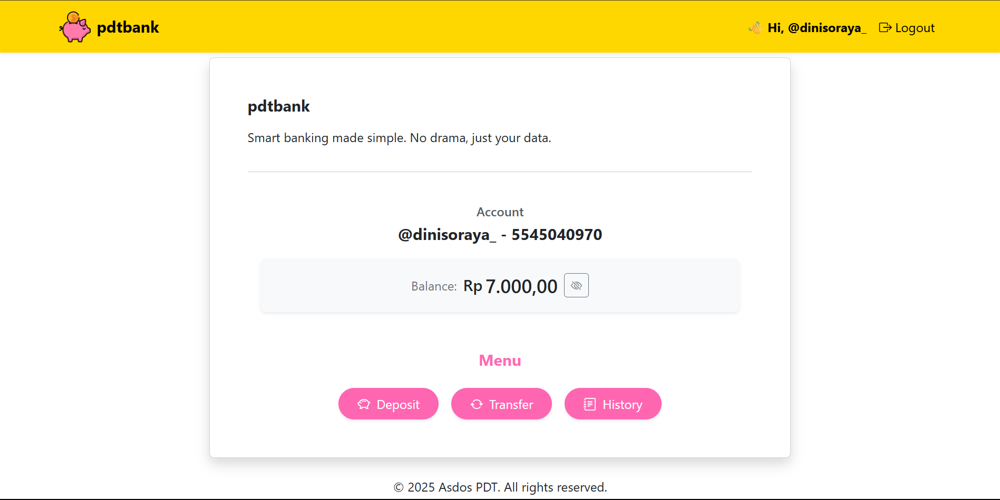

# 🐖 pdtbank (Contoh Proyek UAP) 
Proyek ini merupakan sistem perbankan sederhana yang dibangun menggunakan PHP dan MySQL. Tujuannya adalah untuk mengelola transaksi keuangan secara aman dan konsisten, dengan memanfaatkan stored procedure, trigger, transaction, dan function. Sistem ini juga dilengkapi mekanisme backup otomatis untuk menjaga keamanan data jika terjadi hal yang tidak diinginkan.

## 📌 Detail Konsep

### ⚠️ Disclaimer

Peran  **stored procedure**, **trigger**, **transaction**, dan **function** dalam proyek ini dirancang khusus untuk kebutuhan sistem **pdtbank**. Penerapannya bisa berbeda pada sistem lain, tergantung arsitektur dan kebutuhan masing-masing sistem.

### 🧠 Stored Procedure 
Stored procedure bertindak seperti SOP internal yang menetapkan alur eksekusi berbagai operasi penting di sistem perbankan. 

Beberapa prosedur penting yang digunakan:
* **deposit_money(p_transaction_id, p_to_account, p_amount)**: Menambah saldo akun pengguna serta mencatat detail transaksi setoran.
* **transfer_money(p_transaction_id, p_from_account, p_to_account, p_amount)**: Memastikan saldo pengirim cukup, memperbarui saldo kedua pihak, dan mencatat detail transaksi.
* **get_transaction_history(account)**: Mengambil daftar riwayat transaksi akun pengguna.

Dengan menyimpan proses-proses ini langsung di database, sistem dapat menjamin konsistensi perilaku dan memudahkan pemeliharaan.

### 🚨 Trigger
Trigger `validate_transaction` berfungsi sebagai sistem pengaman otomatis yang aktif sebelum data masuk ke dalam tabel. Seperti palang pintu yang hanya terbuka jika syarat tertentu terpenuhi, trigger mencegah input data yang tidak valid atau berisiko merusak integritas sistem.

Beberapa peran trigger di sistem ini:
* Menolak transaksi ke akun yang invalid.
* Menolak transaksi dengan jumlah yang invalid.
* Mencegah duplikasi transaksi dengan `transaction_id` yang sama.

Dengan adanya trigger, kesalahan dari sisi sistem — seperti kelalaian validasi — tetap dapat dicegah langsung di lapisan database.

### 🔄 Transaction (Transaksi)
Dalam sistem perbankan, sebuah transaksi seperti transfer atau pembukaan rekening tidak dianggap berhasil jika hanya sebagian prosesnya yang selesai. Semua langkah harus dijalankan hingga tuntas — jika salah satu gagal, seluruh proses dibatalkan. Prinsip ini diwujudkan melalui penggunaan `beginTransaction()` dan `commit()` di PHP.

Contohnya, pada proses transfer dan deposit, sistem akan memulai transaksi, menjalankan prosedur penyimpanan (stored procedure), lalu meng-commit perubahan jika berhasil. Namun, jika ditemukan masalah — seperti saldo tidak mencukupi atau akun tidak ditemukan — maka seluruh proses dibatalkan menggunakan `rollback()`. Hal ini mencegah perubahan data yang parsial, seperti saldo yang terpotong padahal transaksi tidak sah.

Demikian pula saat user melakukan registrasi, sistem tidak hanya menyimpan data user, tetapi juga membuat akun bank sekaligus. Proses ini dijalankan dalam satu transaksi untuk memastikan bahwa semua langkah dalam proses harus berhasil bersama; jika salah satunya gagal, maka seluruh proses dibatalkan.

### 📺 Function 
Function digunakan untuk mengambil informasi tanpa mengubah data. Seperti layar monitor: hanya menampilkan data, tidak mengubah apapun.

Contohnya, fungsi  `get_balance(account)` mengembalikan saldo terkini dari sebuah akun. Dengan function, sistem bisa membaca data penting secara cepat dan aman, tanpa risiko mengubah isi database.

### 🔄 Backup Otomatis
Untuk menjaga ketersediaan dan keamanan data, sistem dilengkapi fitur backup otomatis menggunakan `mysqldump`dan task scheduler. Backup dilakukan secara berkala dan disimpan dengan nama file yang mencakup timestamp, sehingga mudah ditelusuri. Semua file disimpan di direktori `storage/backups`.
